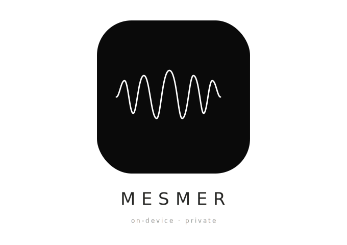

<p align="center">
  
  <br>
  <b>A native, private dictation & text-rewriting tool for macOS</b>
  <br><br>
  <a href="https://github.com/samirpatil2000/mesmer/releases">
    
  </a>
  
  
</p>

# Mesmer

Mesmer is a native, on-device dictation and text-rewriting application for macOS. It provides a system-wide floating toolbar that allows you to transcribe speech directly into any text field or seamlessly rewrite selected text with different personas (Formal, Concise, Friendly, etc.).

All processing happens entirely on your Mac, ensuring complete privacy.

## Features

- **On-Device Dictation**: Uses Apple's native Speech framework for fast, private, and accurate transcription.
- **System-Wide Integration**: Works seamlessly across macOS applications via Accessibility APIs.
- **Smart Rewriting**: Select text in any app, and use the floating Rewrite Toolbar to instantly transform it using Apple's new Foundation Models (`LanguageModelSession`).
- **Custom Personas**: Rewrite text to be formal, concise, friendly, or provide a custom instruction on how you want the text altered.
- **Text Injection**: Automatically injects standard dictations or rewritten text directly into the active application's focused text field.
- **History Tracking**: Keeps a local log of your recent transcriptions and rewrites.
- **Launch at Login**: Option to start Mesmer automatically when you log into your Mac.

## Requirements

- **macOS 26.0 or newer** (Required for the `FoundationModels` framework used by the Rewrite Engine).
- Xcode 16+ (if building from source using Xcode).

## Build Instructions

You can build the application using the included build script which creates a deployable `.dmg` file.

1. Ensure you have the macOS SDK installed (via Xcode Command Line Tools or Xcode).
2. Open Terminal and navigate to the project directory.
3. Run the build script:
   ```bash
   ./build.sh
   ```
4. The script will compile the Swift files, package the `.app` bundle, sign it, and generate `Mesmer_Release.dmg`.

> **Note:** If macOS complains about the app being from an unidentified developer after dragging it from the DMG to Applications, you may need to strip the quarantine attribute manually:
> `xattr -cr /Applications/Mesmer.app`

## Permissions Required

On first launch, Mesmer will request the following system permissions to function correctly:
- **Speech Recognition**: To transcribe audio.
- **Microphone**: To capture your voice.
- **Accessibility**: To read selected text from other apps and inject the rewritten/transcribed text back into them.

## Architecture

Built using modern Apple frameworks:
- **SwiftUI** & **AppKit**: For the native UI, floating panels, and system integration.
- **Speech** & **AVFoundation**: For capturing and converting audio to text.
- **FoundationModels**: For the on-device AI text rewriting features.
- **ApplicationServices** (`AXUIElement`): For deep system-level text reading and injection.
